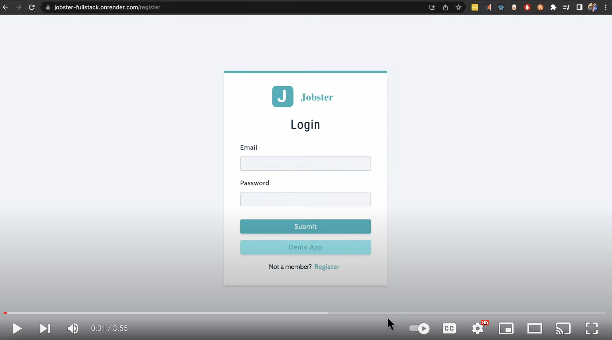

# Jobster - Track your job search in a Full Stack JavaScript MERN app in React + Node + Express + MongoDB 
## Jobster Demo Video:
[](https://www.youtube.com/watch?v=hvZYYkhHWx8 "Jobster Video")
## Link to Jobster - [Jobster](https://jobster-fullstack.onrender.com/register)
### Note Jobster is running on a free tier at Render, if it’s not loading, try again in about 30 seconds.


### See Jobster live at https://jobster-fullstack.onrender.com/register 

### Overview:
Check out my app Jobster, it helps you track your job search. Jobster allows you to create new jobs you have applied for, show all the jobs, be able to update the status of the job and also be able to delete a job. 


You can demo the app by visiting https://jobster-fullstack.onrender.com/register and clicking the light blue 'Demo App' button or you can create an account*. 

When you login you are taken to the all jobs page. Here you have the option to search for the job you are looking to update. You can also search with other criteria such as status and job type. As you type the name of the job title you will see the number of matching jobs is updating automatically and a spinner appears. You can click the edit button on the job you want to edit and adjust it by taking actions such as updating the status to 'interview'. This helps you see where in the process you are with a certain job. Click submit to save and you will see a green alert box saying job updated that will be automatically cleared after 3 seconds. If there is an error you will see a red alert box which will give information about the error. Now if you go back to all jobs, you will see your most recently edited job on the all jobs page. You can also add a job, there is an alert box to confirm the job added. Lastly you can come to your profile and change account information such as your name. There is an alert here as well. Alerts power the user experience and give information to the user.

### Technical Details on Front End - React:
On the Jobster front end React is used to build reusable React components including the text input boxes, dropdown menus and logo appearance. It works on mobile devices as well. To avoid issues with CSS leaking, styled-components are used. The all jobs page uses a container component design pattern to trigger adding and running new search values.

The Context API is used to pass prop data throughout the application without prop drilling. This is done in a stateful way by using the useReducer React hook. This hook stores Jobsters global state and provides the dispatch function. The dispatch function is used in named functions to make changes to the state, including error handling. These named functions allow the user to asynchronously update the api data for Jobster and get alerts when actions are done. 

To keep state in the application on reloads a function will reload user data on refresh. This is done to not use local storage for increased security. 

There is protected routing setup so a user who is not logged in cannot access the application pages. 

### Technical Details on Back End - Node, Express and MongoDB: 
When a user logs in Jobster authenticates them and a cookie is sent to the user. 


This cookie has a JSON web token used to authenticate the user. All authentication is server side. All api endpoints used to update job information require authentication. The backend api also has data validation setup for both User and Job models. Controllers in Express are used to update models in an asynchronous way. If a request is not valid the controller makes an error message with details and sends it to the user. Cookies are valid for 1 day. For security hemlet, xss-clean and express-mongo-sanitize are used to prevent NoSQL injection and cross site scripting. There is also middleware to check permissions that can be used for authorization.

### Opinions and extras:
In my opinion the best part of Jobster for an average user is the green and red alert messages. It is accomplished with state management in the front end that also has error handling. All actions get messages so a user can see Jobster is working.

Something a user will not see that protects them is passwords are salted so the plaintext password is not stored on the server.

The part of building this app I learned the most from was setting up the authentication. Originally it was using a token in local storage, this was changed to use a cookie for more security. This also simplified the front end code by not having to code local storage of a token. 

The one exception to setting an alert message is if a user's cookie has expired, here the user is taken to the login page to login and get a new cookie. This is done to get the user to take the corrective action and be able to have an easy to use experience.

In the front end it was interesting to use a proxy to avoid CORS errors.

Thanks for taking a look at Jobster the new way to track your job search!

*Jobster is running on a free tier at Render, if it’s not loading, try again in about 30 seconds.

#### Run The App Locally

```sh
npm run install-dependencies
```

- rename .env.temp to .env
- setup values for - MONGO_URL, JWT_SECRET, JWT_LIFETIME

```sh
npm start
```

- visit url http://localhost:3000/